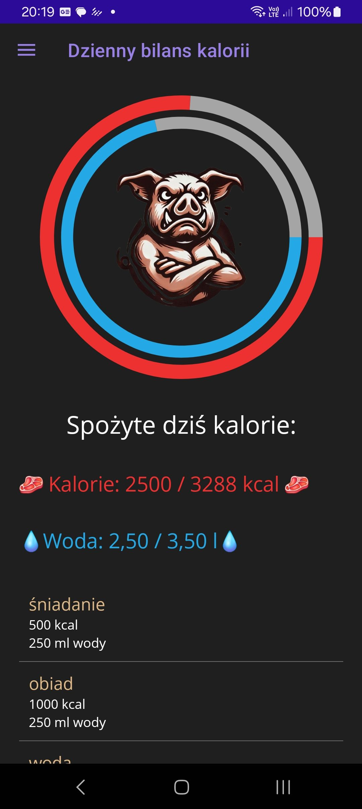

# 🐷 KorytoApp

🐽 KorytoApp - Calorie and Water Tracker for Glorious Gluttons 
KalorieApp is a .NET MAUI-based mobile application that helps you keep track of your daily calorie intake and water consumption, while calculating essential stats like BMI and BMR. 
Perfect for health-conscious people, gym rats... or just trying to get their life together. 🐷💧🔥 

## 💡 Features 
🧠 User Profiles - Manage multiple users with personal data (height, weight, age, gender) 
🧮 Automatic Calculations - BMI (Body Mass Index) and BMR (Basal Metabolic Rate) 
🍖 Calorie Tracking - Add and review what you’ve eaten, day by day 
💧 Water Intake Logging - Track hydration throughout the day 
📊 History View - See what you consumed on any date 
🐽 Funny UI - Motivational messages with a playful attitude 
🔔 (Planned) Notifications to drink more water  

## 📱 Built With 
✅ .NET MAUI - Cross-platform UI framework 
✅ SQLite - Lightweight embedded database 
✅ C# - For beautiful, powerful logic 
✅ Visual Studio 2022 Preview - IDE of dreams 
 

